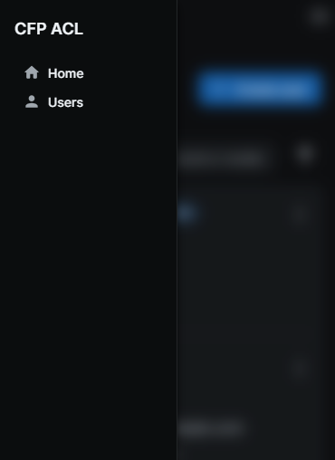
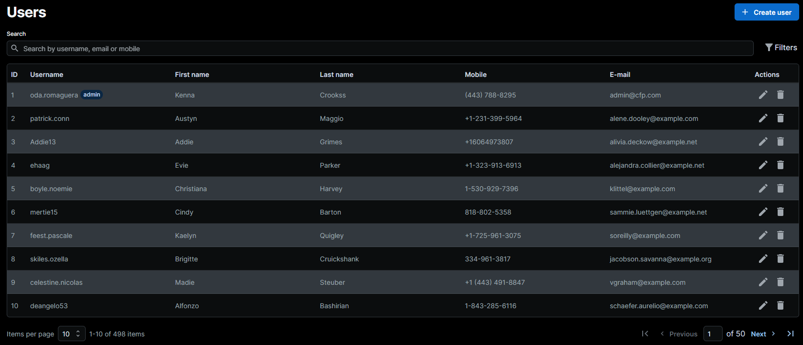

[](https://conventionalcommits.org)

# PHP Technical Test
This test is designed for Full Stack Developers applying for a position at [CFP Energy](https://www.cfp.energy).

## User management application
The main function of this application is to manage the user personal data and credentials

### Requirements
- [x] CRUD from users
- [x] Backend using PHP 
  - You can check out the source code in [laravel-api](./laravel-api)
- [x] Front end using React
  - You can check out the source code in [front](./front)

### Optional requerments
- [x] tests in the backend
- [x] early returns
- [x] docker
- [x] commit process regularly
- [x] conventional commits
---
# Backend
## Technology used:
- [Laravel](https://laravel.com/): Web application Framework
- [Laravel Sanctum](https://laravel.com/docs/10.x/sanctum): Authentication
- [Laravel Pint](https://laravel.com/docs/10.x/pint): Code format
- [Pest PHP](https://pestphp.com/): Write test
- [Laravel IDE Helper](https://github.com/barryvdh/laravel-ide-helper): IDE Helper Generator for Laravel
- [PostgreSQL](https://www.postgresql.org/): Relational Database


## Features
The API was built using the laravel best practices.

### Cookie-based Session Authentication
Using Laravel Sanctum, authentication is managed through secure, HTTP-only cookies, ensuring user sessions are encrypted
and protected against unauthorized access. More about on [sanctum docs](https://laravel.com/docs/10.x/sanctum#spa-authentication).

### Password security
On the [AuthServiceProvider](./laravel-api/app/Providers/AppServiceProvider.php) it was modified the
[default rules](https://laravel.com/docs/10.x/validation#defining-default-password-rules) for password, now it must
have mixed case at least a number and a symbol, and be between 8 and 30 characters.

### Request validation
All requests are validated using [FormRequest](https://laravel.com/docs/10.x/validation#form-request-validation),
ensuring data integrity.

### Responses
Each entity is represented by a [JsonResource](https://laravel.com/docs/10.x/eloquent-resources) class, ensuring
cleaner and more consistent code. The appropriate HTTP status codes are used for responses.

### Invokable Controllers
Enhance code manageability with invokable controllers, assigning a specific controller to each endpoint.
Dependency injection is utilized for FormRequest, Service, and other necessary dependencies

### Migrations
Database migrations are utilized for efficient database schema management.

### Tests
Comprehensive testing is ensured through the use of [Pest](https://pestphp.com/), covering all endpoints and services
to guarantee robust functionality and reliability.

# Frontend
## Technology used:
- [React18](https://react.dev/)
- [mui/joy-ui](https://mui.com/joy-ui/getting-started/): IU tools for React
- [Formik](formik.org): Form state management library
- [Yup](https://www.npmjs.com/package/yup): Schema-based validation library
- [tanstack/react-query](https://tanstack.com/query): API response state management.

## Features

### Single Page Application (SPA)
The frontend is built as a Single Page Application (SPA) using [react-router](https://reactrouter.com/en/main).
This architecture ensures a seamless user experience by loading assets only once. With react-router, navigating between
pages requires refreshing only the necessary components, reducing load times and enhancing overall performance.

### Authentication
To access pages, the application sends a request to the backend to check if the user is authenticated based on their
cookies. If the user is not authenticated, react-router will navigate to the Login page. Otherwise, the requested page
will be loaded.

Following the initial authentication check, if a request receives a 401 error (unauthorized), an interceptor has been
added to Axios. This interceptor redirects the user back to the Login page. If the user attempts to refresh the page,
the authentication check will again navigate to the Login page.

For implementation details:
- The interceptor implementation can be found in [api.ts](./front/src/services/api.ts).
- The authentication check request is handled in the component [ProtectedRoute.tsx](./front/src/components/ProtectedRoute.tsx), which triggers the API call through the entity [Auth.ts](./front/src/entities/Auth.ts).


### HTTP State
The application uses [tanstack/react-query](https://tanstack.com/query) to manage HTTP state effectively.
The user list is cached in the user's browser, enabling efficient creation, update, and deletion of users.
This approach ensures that when user-related actions are performed, such as creating, updating, or deleting a user,
only the query value is updated without needing to fetch new data from the API each time.

This functionality is implemented using [queries](https://tanstack.com/query/latest/docs/framework/react/guides/queries)
for fetching data and [mutations](https://tanstack.com/query/latest/docs/framework/react/guides/mutations) for modifying
it.

To explore the implementation details, refer to the following files:
- [UserList](./front/src/pages/Users/index.tsx)
- [UserForm](./front/src/pages/Users/form.tsx)
- [UserView](./front/src/pages/Users/view.tsx)

### Responsive design
When a user opens the application on a mobile or tablet, the package
[react-device-detect](https://www.npmjs.com/package/react-device-detect) sets the variable `isMobile` to true, and
specific mobile components are loaded, such as the menu. On desktop, it's exhibited as a SideBar, and on mobile, it's a
burger icon that opens a drawer.

<div style="display: flex; justify-content: space-around; height: 400px">
    <div style="text-align: center;">
        
        <p>Menu open on mobile</p>
    </div>
    <div style="text-align: center;">
        
        <p>Menu closed on mobile</p>
    </div>
</div>

The user information on desktop is presented as a table, as required in the test requirements.
Here is an image of how it is displayed:


### Dark mode
The application provides a Dark Mode option for enhanced user experience. Whether you're accessing the application on a
desktop browser with the sidebar or on a mobile device with the drawer, you have the flexibility to switch between light
and dark themes seamlessly.

To implement this feature, the
[mode toggle component](https://mui.com/joy-ui/customization/dark-mode/#creating-a-mode-toggle-component). was utilized.
This component simplifies the process of toggling between light and dark themes.

````js
const { mode, setMode } = useColorScheme(); 
````
